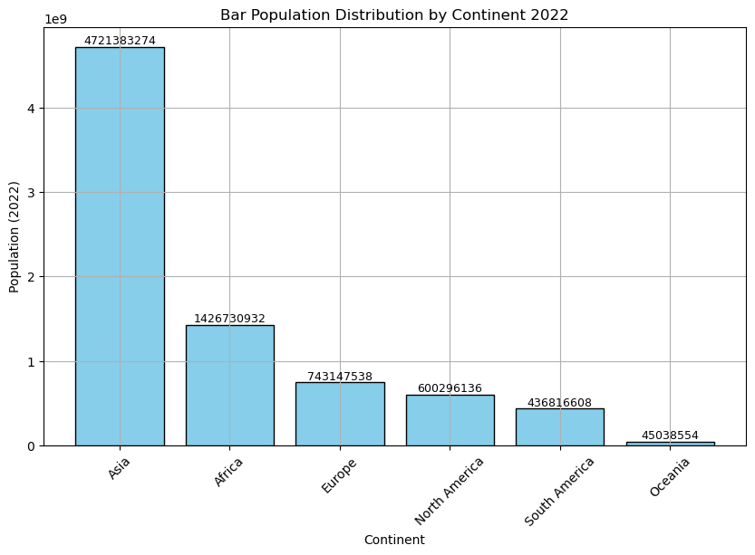
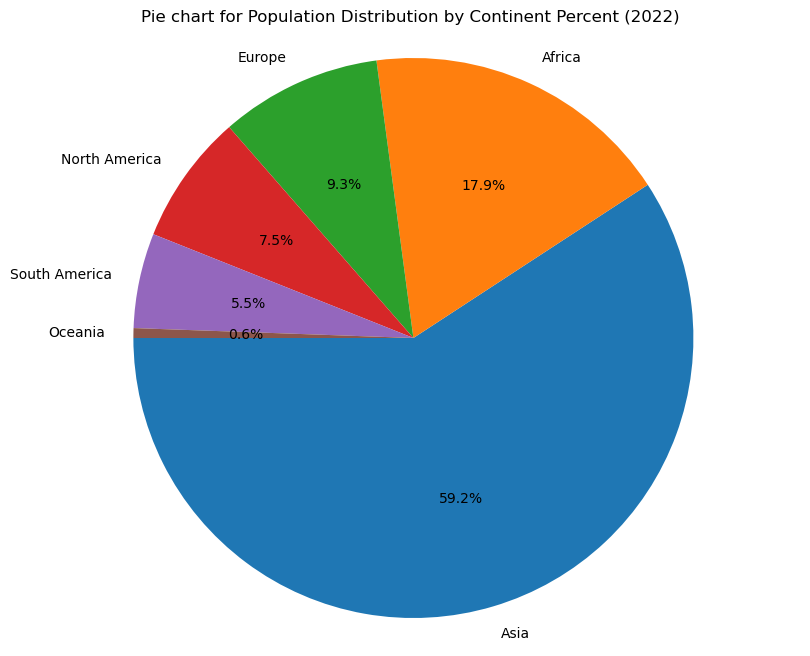

```python
import pandas as pd
import seaborn as sns
import matplotlib.pyplot as plt
import numpy as np
```


```python
df = pd.read_csv("C:/Users/YES_GEE/Desktop/world_population.csv")
df
```


<div>
<style scoped>
    .dataframe tbody tr th:only-of-type {
        vertical-align: middle;
    }

    .dataframe tbody tr th {
        vertical-align: top;
    }

    .dataframe thead th {
        text-align: right;
    }
</style>
<table border="1" class="dataframe">
  <thead>
    <tr style="text-align: right;">
      <th></th>
      <th>Rank</th>
      <th>CCA3</th>
      <th>Country/Territory</th>
      <th>Capital</th>
      <th>Continent</th>
      <th>2022 Population</th>
      <th>2020 Population</th>
      <th>2015 Population</th>
      <th>2010 Population</th>
      <th>2000 Population</th>
      <th>1990 Population</th>
      <th>1980 Population</th>
      <th>1970 Population</th>
      <th>Area (km²)</th>
      <th>Density (per km²)</th>
      <th>Growth Rate</th>
      <th>World Population Percentage</th>
    </tr>
  </thead>
  <tbody>
    <tr>
      <th>0</th>
      <td>36</td>
      <td>AFG</td>
      <td>Afghanistan</td>
      <td>Kabul</td>
      <td>Asia</td>
      <td>41128771</td>
      <td>38972230</td>
      <td>33753499</td>
      <td>28189672</td>
      <td>19542982</td>
      <td>10694796</td>
      <td>12486631</td>
      <td>10752971</td>
      <td>652230</td>
      <td>63.0587</td>
      <td>1.0257</td>
      <td>0.52</td>
    </tr>
    <tr>
      <th>1</th>
      <td>138</td>
      <td>ALB</td>
      <td>Albania</td>
      <td>Tirana</td>
      <td>Europe</td>
      <td>2842321</td>
      <td>2866849</td>
      <td>2882481</td>
      <td>2913399</td>
      <td>3182021</td>
      <td>3295066</td>
      <td>2941651</td>
      <td>2324731</td>
      <td>28748</td>
      <td>98.8702</td>
      <td>0.9957</td>
      <td>0.04</td>
    </tr>
    <tr>
      <th>2</th>
      <td>34</td>
      <td>DZA</td>
      <td>Algeria</td>
      <td>Algiers</td>
      <td>Africa</td>
      <td>44903225</td>
      <td>43451666</td>
      <td>39543154</td>
      <td>35856344</td>
      <td>30774621</td>
      <td>25518074</td>
      <td>18739378</td>
      <td>13795915</td>
      <td>2381741</td>
      <td>18.8531</td>
      <td>1.0164</td>
      <td>0.56</td>
    </tr>
    <tr>
      <th>3</th>
      <td>213</td>
      <td>ASM</td>
      <td>American Samoa</td>
      <td>Pago Pago</td>
      <td>Oceania</td>
      <td>44273</td>
      <td>46189</td>
      <td>51368</td>
      <td>54849</td>
      <td>58230</td>
      <td>47818</td>
      <td>32886</td>
      <td>27075</td>
      <td>199</td>
      <td>222.4774</td>
      <td>0.9831</td>
      <td>0.00</td>
    </tr>
    <tr>
      <th>4</th>
      <td>203</td>
      <td>AND</td>
      <td>Andorra</td>
      <td>Andorra la Vella</td>
      <td>Europe</td>
      <td>79824</td>
      <td>77700</td>
      <td>71746</td>
      <td>71519</td>
      <td>66097</td>
      <td>53569</td>
      <td>35611</td>
      <td>19860</td>
      <td>468</td>
      <td>170.5641</td>
      <td>1.0100</td>
      <td>0.00</td>
    </tr>
    <tr>
      <th>...</th>
      <td>...</td>
      <td>...</td>
      <td>...</td>
      <td>...</td>
      <td>...</td>
      <td>...</td>
      <td>...</td>
      <td>...</td>
      <td>...</td>
      <td>...</td>
      <td>...</td>
      <td>...</td>
      <td>...</td>
      <td>...</td>
      <td>...</td>
      <td>...</td>
      <td>...</td>
    </tr>
    <tr>
      <th>229</th>
      <td>226</td>
      <td>WLF</td>
      <td>Wallis and Futuna</td>
      <td>Mata-Utu</td>
      <td>Oceania</td>
      <td>11572</td>
      <td>11655</td>
      <td>12182</td>
      <td>13142</td>
      <td>14723</td>
      <td>13454</td>
      <td>11315</td>
      <td>9377</td>
      <td>142</td>
      <td>81.4930</td>
      <td>0.9953</td>
      <td>0.00</td>
    </tr>
    <tr>
      <th>230</th>
      <td>172</td>
      <td>ESH</td>
      <td>Western Sahara</td>
      <td>El Aaiún</td>
      <td>Africa</td>
      <td>575986</td>
      <td>556048</td>
      <td>491824</td>
      <td>413296</td>
      <td>270375</td>
      <td>178529</td>
      <td>116775</td>
      <td>76371</td>
      <td>266000</td>
      <td>2.1654</td>
      <td>1.0184</td>
      <td>0.01</td>
    </tr>
    <tr>
      <th>231</th>
      <td>46</td>
      <td>YEM</td>
      <td>Yemen</td>
      <td>Sanaa</td>
      <td>Asia</td>
      <td>33696614</td>
      <td>32284046</td>
      <td>28516545</td>
      <td>24743946</td>
      <td>18628700</td>
      <td>13375121</td>
      <td>9204938</td>
      <td>6843607</td>
      <td>527968</td>
      <td>63.8232</td>
      <td>1.0217</td>
      <td>0.42</td>
    </tr>
    <tr>
      <th>232</th>
      <td>63</td>
      <td>ZMB</td>
      <td>Zambia</td>
      <td>Lusaka</td>
      <td>Africa</td>
      <td>20017675</td>
      <td>18927715</td>
      <td>16248230</td>
      <td>13792086</td>
      <td>9891136</td>
      <td>7686401</td>
      <td>5720438</td>
      <td>4281671</td>
      <td>752612</td>
      <td>26.5976</td>
      <td>1.0280</td>
      <td>0.25</td>
    </tr>
    <tr>
      <th>233</th>
      <td>74</td>
      <td>ZWE</td>
      <td>Zimbabwe</td>
      <td>Harare</td>
      <td>Africa</td>
      <td>16320537</td>
      <td>15669666</td>
      <td>14154937</td>
      <td>12839771</td>
      <td>11834676</td>
      <td>10113893</td>
      <td>7049926</td>
      <td>5202918</td>
      <td>390757</td>
      <td>41.7665</td>
      <td>1.0204</td>
      <td>0.20</td>
    </tr>
  </tbody>
</table>
<p>234 rows × 17 columns</p>
</div>


```python
df.head(10)
```


<div>
<style scoped>
    .dataframe tbody tr th:only-of-type {
        vertical-align: middle;
    }

    .dataframe tbody tr th {
        vertical-align: top;
    }

    .dataframe thead th {
        text-align: right;
    }
</style>
<table border="1" class="dataframe">
  <thead>
    <tr style="text-align: right;">
      <th></th>
      <th>Rank</th>
      <th>CCA3</th>
      <th>Country/Territory</th>
      <th>Capital</th>
      <th>Continent</th>
      <th>2022 Population</th>
      <th>2020 Population</th>
      <th>2015 Population</th>
      <th>2010 Population</th>
      <th>2000 Population</th>
      <th>1990 Population</th>
      <th>1980 Population</th>
      <th>1970 Population</th>
      <th>Area (km²)</th>
      <th>Density (per km²)</th>
      <th>Growth Rate</th>
      <th>World Population Percentage</th>
    </tr>
  </thead>
  <tbody>
    <tr>
      <th>0</th>
      <td>36</td>
      <td>AFG</td>
      <td>Afghanistan</td>
      <td>Kabul</td>
      <td>Asia</td>
      <td>41128771</td>
      <td>38972230</td>
      <td>33753499</td>
      <td>28189672</td>
      <td>19542982</td>
      <td>10694796</td>
      <td>12486631</td>
      <td>10752971</td>
      <td>652230</td>
      <td>63.0587</td>
      <td>1.0257</td>
      <td>0.52</td>
    </tr>
    <tr>
      <th>1</th>
      <td>138</td>
      <td>ALB</td>
      <td>Albania</td>
      <td>Tirana</td>
      <td>Europe</td>
      <td>2842321</td>
      <td>2866849</td>
      <td>2882481</td>
      <td>2913399</td>
      <td>3182021</td>
      <td>3295066</td>
      <td>2941651</td>
      <td>2324731</td>
      <td>28748</td>
      <td>98.8702</td>
      <td>0.9957</td>
      <td>0.04</td>
    </tr>
    <tr>
      <th>2</th>
      <td>34</td>
      <td>DZA</td>
      <td>Algeria</td>
      <td>Algiers</td>
      <td>Africa</td>
      <td>44903225</td>
      <td>43451666</td>
      <td>39543154</td>
      <td>35856344</td>
      <td>30774621</td>
      <td>25518074</td>
      <td>18739378</td>
      <td>13795915</td>
      <td>2381741</td>
      <td>18.8531</td>
      <td>1.0164</td>
      <td>0.56</td>
    </tr>
    <tr>
      <th>3</th>
      <td>213</td>
      <td>ASM</td>
      <td>American Samoa</td>
      <td>Pago Pago</td>
      <td>Oceania</td>
      <td>44273</td>
      <td>46189</td>
      <td>51368</td>
      <td>54849</td>
      <td>58230</td>
      <td>47818</td>
      <td>32886</td>
      <td>27075</td>
      <td>199</td>
      <td>222.4774</td>
      <td>0.9831</td>
      <td>0.00</td>
    </tr>
    <tr>
      <th>4</th>
      <td>203</td>
      <td>AND</td>
      <td>Andorra</td>
      <td>Andorra la Vella</td>
      <td>Europe</td>
      <td>79824</td>
      <td>77700</td>
      <td>71746</td>
      <td>71519</td>
      <td>66097</td>
      <td>53569</td>
      <td>35611</td>
      <td>19860</td>
      <td>468</td>
      <td>170.5641</td>
      <td>1.0100</td>
      <td>0.00</td>
    </tr>
    <tr>
      <th>5</th>
      <td>42</td>
      <td>AGO</td>
      <td>Angola</td>
      <td>Luanda</td>
      <td>Africa</td>
      <td>35588987</td>
      <td>33428485</td>
      <td>28127721</td>
      <td>23364185</td>
      <td>16394062</td>
      <td>11828638</td>
      <td>8330047</td>
      <td>6029700</td>
      <td>1246700</td>
      <td>28.5466</td>
      <td>1.0315</td>
      <td>0.45</td>
    </tr>
    <tr>
      <th>6</th>
      <td>224</td>
      <td>AIA</td>
      <td>Anguilla</td>
      <td>The Valley</td>
      <td>North America</td>
      <td>15857</td>
      <td>15585</td>
      <td>14525</td>
      <td>13172</td>
      <td>11047</td>
      <td>8316</td>
      <td>6560</td>
      <td>6283</td>
      <td>91</td>
      <td>174.2527</td>
      <td>1.0066</td>
      <td>0.00</td>
    </tr>
    <tr>
      <th>7</th>
      <td>201</td>
      <td>ATG</td>
      <td>Antigua and Barbuda</td>
      <td>Saint John’s</td>
      <td>North America</td>
      <td>93763</td>
      <td>92664</td>
      <td>89941</td>
      <td>85695</td>
      <td>75055</td>
      <td>63328</td>
      <td>64888</td>
      <td>64516</td>
      <td>442</td>
      <td>212.1335</td>
      <td>1.0058</td>
      <td>0.00</td>
    </tr>
    <tr>
      <th>8</th>
      <td>33</td>
      <td>ARG</td>
      <td>Argentina</td>
      <td>Buenos Aires</td>
      <td>South America</td>
      <td>45510318</td>
      <td>45036032</td>
      <td>43257065</td>
      <td>41100123</td>
      <td>37070774</td>
      <td>32637657</td>
      <td>28024803</td>
      <td>23842803</td>
      <td>2780400</td>
      <td>16.3683</td>
      <td>1.0052</td>
      <td>0.57</td>
    </tr>
    <tr>
      <th>9</th>
      <td>140</td>
      <td>ARM</td>
      <td>Armenia</td>
      <td>Yerevan</td>
      <td>Asia</td>
      <td>2780469</td>
      <td>2805608</td>
      <td>2878595</td>
      <td>2946293</td>
      <td>3168523</td>
      <td>3556539</td>
      <td>3135123</td>
      <td>2534377</td>
      <td>29743</td>
      <td>93.4831</td>
      <td>0.9962</td>
      <td>0.03</td>
    </tr>
  </tbody>
</table>
</div>


```python
df.shape
```


    (234, 17)


```python
df.info()
```

    <class 'pandas.core.frame.DataFrame'>
    RangeIndex: 234 entries, 0 to 233
    Data columns (total 17 columns):
     #   Column                       Non-Null Count  Dtype  
    ---  ------                       --------------  -----  
     0   Rank                         234 non-null    int64  
     1   CCA3                         234 non-null    object 
     2   Country/Territory            234 non-null    object 
     3   Capital                      234 non-null    object 
     4   Continent                    234 non-null    object 
     5   2022 Population              234 non-null    int64  
     6   2020 Population              234 non-null    int64  
     7   2015 Population              234 non-null    int64  
     8   2010 Population              234 non-null    int64  
     9   2000 Population              234 non-null    int64  
     10  1990 Population              234 non-null    int64  
     11  1980 Population              234 non-null    int64  
     12  1970 Population              234 non-null    int64  
     13  Area (km²)                   234 non-null    int64  
     14  Density (per km²)            234 non-null    float64
     15  Growth Rate                  234 non-null    float64
     16  World Population Percentage  234 non-null    float64
    dtypes: float64(3), int64(10), object(4)
    memory usage: 31.2+ KB
    


```python
df.rename(columns={"id":"ID"}, inplace=True)
df.columns
```


    Index(['Rank', 'CCA3', 'Country/Territory', 'Capital', 'Continent',
           '2022 Population', '2020 Population', '2015 Population',
           '2010 Population', '2000 Population', '1990 Population',
           '1980 Population', '1970 Population', 'Area (km²)', 'Density (per km²)',
           'Growth Rate', 'World Population Percentage'],
          dtype='object')


# Exploratoy data analysis


```python
df.corr(numeric_only =True)
```


<div>
<style scoped>
    .dataframe tbody tr th:only-of-type {
        vertical-align: middle;
    }

    .dataframe tbody tr th {
        vertical-align: top;
    }

    .dataframe thead th {
        text-align: right;
    }
</style>
<table border="1" class="dataframe">
  <thead>
    <tr style="text-align: right;">
      <th></th>
      <th>Rank</th>
      <th>2022 Population</th>
      <th>2020 Population</th>
      <th>2015 Population</th>
      <th>2010 Population</th>
      <th>2000 Population</th>
      <th>1990 Population</th>
      <th>1980 Population</th>
      <th>1970 Population</th>
      <th>Area (km²)</th>
      <th>Density (per km²)</th>
      <th>Growth Rate</th>
      <th>World Population Percentage</th>
    </tr>
  </thead>
  <tbody>
    <tr>
      <th>Rank</th>
      <td>1.000000</td>
      <td>-0.358361</td>
      <td>-0.355854</td>
      <td>-0.351222</td>
      <td>-0.347461</td>
      <td>-0.341057</td>
      <td>-0.336152</td>
      <td>-0.335246</td>
      <td>-0.335379</td>
      <td>-0.383774</td>
      <td>0.129436</td>
      <td>-0.224561</td>
      <td>-0.358464</td>
    </tr>
    <tr>
      <th>2022 Population</th>
      <td>-0.358361</td>
      <td>1.000000</td>
      <td>0.999946</td>
      <td>0.999490</td>
      <td>0.998629</td>
      <td>0.994605</td>
      <td>0.987228</td>
      <td>0.980285</td>
      <td>0.973162</td>
      <td>0.453411</td>
      <td>-0.027618</td>
      <td>-0.020863</td>
      <td>0.999999</td>
    </tr>
    <tr>
      <th>2020 Population</th>
      <td>-0.355854</td>
      <td>0.999946</td>
      <td>1.000000</td>
      <td>0.999763</td>
      <td>0.999105</td>
      <td>0.995583</td>
      <td>0.988724</td>
      <td>0.982121</td>
      <td>0.975254</td>
      <td>0.454993</td>
      <td>-0.027358</td>
      <td>-0.025116</td>
      <td>0.999944</td>
    </tr>
    <tr>
      <th>2015 Population</th>
      <td>-0.351222</td>
      <td>0.999490</td>
      <td>0.999763</td>
      <td>1.000000</td>
      <td>0.999783</td>
      <td>0.997340</td>
      <td>0.991594</td>
      <td>0.985724</td>
      <td>0.979414</td>
      <td>0.458240</td>
      <td>-0.026857</td>
      <td>-0.032154</td>
      <td>0.999487</td>
    </tr>
    <tr>
      <th>2010 Population</th>
      <td>-0.347461</td>
      <td>0.998629</td>
      <td>0.999105</td>
      <td>0.999783</td>
      <td>1.000000</td>
      <td>0.998593</td>
      <td>0.993929</td>
      <td>0.988786</td>
      <td>0.983042</td>
      <td>0.461936</td>
      <td>-0.026505</td>
      <td>-0.037983</td>
      <td>0.998626</td>
    </tr>
    <tr>
      <th>2000 Population</th>
      <td>-0.341057</td>
      <td>0.994605</td>
      <td>0.995583</td>
      <td>0.997340</td>
      <td>0.998593</td>
      <td>1.000000</td>
      <td>0.998336</td>
      <td>0.995160</td>
      <td>0.990956</td>
      <td>0.473933</td>
      <td>-0.026139</td>
      <td>-0.050515</td>
      <td>0.994598</td>
    </tr>
    <tr>
      <th>1990 Population</th>
      <td>-0.336152</td>
      <td>0.987228</td>
      <td>0.988724</td>
      <td>0.991594</td>
      <td>0.993929</td>
      <td>0.998336</td>
      <td>1.000000</td>
      <td>0.999042</td>
      <td>0.996602</td>
      <td>0.486764</td>
      <td>-0.026224</td>
      <td>-0.062397</td>
      <td>0.987218</td>
    </tr>
    <tr>
      <th>1980 Population</th>
      <td>-0.335246</td>
      <td>0.980285</td>
      <td>0.982121</td>
      <td>0.985724</td>
      <td>0.988786</td>
      <td>0.995160</td>
      <td>0.999042</td>
      <td>1.000000</td>
      <td>0.999194</td>
      <td>0.498166</td>
      <td>-0.026587</td>
      <td>-0.072349</td>
      <td>0.980273</td>
    </tr>
    <tr>
      <th>1970 Population</th>
      <td>-0.335379</td>
      <td>0.973162</td>
      <td>0.975254</td>
      <td>0.979414</td>
      <td>0.983042</td>
      <td>0.990956</td>
      <td>0.996602</td>
      <td>0.999194</td>
      <td>1.000000</td>
      <td>0.509940</td>
      <td>-0.026881</td>
      <td>-0.081313</td>
      <td>0.973150</td>
    </tr>
    <tr>
      <th>Area (km²)</th>
      <td>-0.383774</td>
      <td>0.453411</td>
      <td>0.454993</td>
      <td>0.458240</td>
      <td>0.461936</td>
      <td>0.473933</td>
      <td>0.486764</td>
      <td>0.498166</td>
      <td>0.509940</td>
      <td>1.000000</td>
      <td>-0.063128</td>
      <td>-0.013970</td>
      <td>0.453284</td>
    </tr>
    <tr>
      <th>Density (per km²)</th>
      <td>0.129436</td>
      <td>-0.027618</td>
      <td>-0.027358</td>
      <td>-0.026857</td>
      <td>-0.026505</td>
      <td>-0.026139</td>
      <td>-0.026224</td>
      <td>-0.026587</td>
      <td>-0.026881</td>
      <td>-0.063128</td>
      <td>1.000000</td>
      <td>-0.069753</td>
      <td>-0.027646</td>
    </tr>
    <tr>
      <th>Growth Rate</th>
      <td>-0.224561</td>
      <td>-0.020863</td>
      <td>-0.025116</td>
      <td>-0.032154</td>
      <td>-0.037983</td>
      <td>-0.050515</td>
      <td>-0.062397</td>
      <td>-0.072349</td>
      <td>-0.081313</td>
      <td>-0.013970</td>
      <td>-0.069753</td>
      <td>1.000000</td>
      <td>-0.020930</td>
    </tr>
    <tr>
      <th>World Population Percentage</th>
      <td>-0.358464</td>
      <td>0.999999</td>
      <td>0.999944</td>
      <td>0.999487</td>
      <td>0.998626</td>
      <td>0.994598</td>
      <td>0.987218</td>
      <td>0.980273</td>
      <td>0.973150</td>
      <td>0.453284</td>
      <td>-0.027646</td>
      <td>-0.020930</td>
      <td>1.000000</td>
    </tr>
  </tbody>
</table>
</div>


```python
grouped_df = df.groupby('Continent').sum(numeric_only=True).sort_values(by="2022 Population", ascending=False)

plt.figure(figsize=(10, 6))
plt.bar(grouped_df.index, grouped_df['2022 Population'], color='skyblue', edgecolor='black')
plt.xlabel('Continent')
plt.ylabel('Population (2022)')
plt.title('Bar Population Distribution by Continent 2022')
plt.xticks(rotation=45)
plt.grid(True)

# Adding data labels above each bar
for i, v in enumerate(grouped_df['2022 Population']):
    plt.text(i, v + 500000, str(v), ha='center', va='bottom', fontsize=9)

plt.show()
```


    

    


```python
grouped_df = df.groupby('Continent').sum(numeric_only=True).sort_values(by="2022 Population", ascending=False)

labels = grouped_df.index.tolist()
sizes = grouped_df["2022 Population"].tolist()

plt.figure(figsize=(10, 8))  
plt.pie(sizes, labels=labels, autopct='%1.1f%%', startangle=180)  
plt.axis('equal')  
plt.title("Pie chart for Population Distribution by Continent Percent (2022) ")  
plt.show()
```


    

    


```python

```
